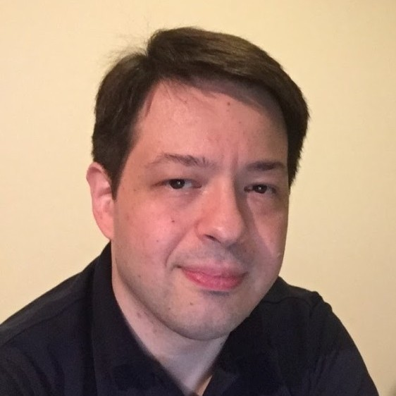

# Davide Pasca's programmer portfolio

Programming represents the pinnacle of exploration and creativity for me. I'm deeply involved in R&D, constantly pursuing innovative ideas and technologies. Over the years I also found significant satisfaction in developing impactful software, particularly in gaming, interactive media, quantitative trading, and developer tools.

I speak Italian, English, Japanese, and occasionally touch on some other languages.

## Career

My focus is spread across several personal projects, new and old. The newest is [OVERSWEEP](#oversweep), a commercial combat flight game in **C++** and **Vulkan** that I am building solo, drawing on the flight-simulation work I did on [XPSVR](#xpsvr-experimental-flight-simulator). At the other end I keep maintaining and improving my mobile games, [Fractal Combat X](#fractal-combat-x) and [Final Freeway 2R](#final-freeway-2r).

[Little Control Room](#little-control-room) sits in the middle of that. It is the control center I use to run several projects and coding agents at once, and it is as much an experiment as a tool: I am using it to find out how far productivity can be pushed by building for the way I work, instead of adapting to whatever a vendor ships. Current AI tools are what make a tool at that level affordable for one person to build and maintain.

AI is not a recent interest of mine. Before the current wave I applied **AI / ML** to **financial market forecasting** ([ENZO-TS](#enzo-trading-system)) and to **autopilot** for airframes ([XPSVR](#xpsvr-experimental-flight-simulator)). Today it also means [R&D](#ai-rnd) with **PyTorch**, and product work on top of LLM APIs, tool orchestration, and agent-based architectures.

Since the mid-90s I've been working on **game development** and **real-time 3D graphics**, gaining experience in major gaming corporations as well as spearheading projects at my own [development studio](https://oykgames.com).

I keep room for contract work. Anything close to graphics, simulation, performance, or AI products tends to be a good fit, and unusual problems are welcome.

## How I work today

I'm not a terribly nostalgic person, and while I do appreciate how programming used to be and the personal benefits I received from doing it manually, I also realize that my passion for technology and the will to build more and better is stronger than the pure activity of writing code. Writing code itself has changed a lot over the years, from the daunting task of writing terse assembly code trying to shave every cycle to high-level languages and package systems that allow for rapid development of fairly complex applications.

LLMs are the latest step in that direction, and they are now a normal part of how I work. What I get out of them is roughly proportional to what I already know.

Two things changed in practice. One is reach: **AskMei.ai**, **Little Control Room**, and **Fractal Strike** are written in languages I never formally learned, which used to be a good reason not to start at all. The other is that experiments and tools became cheap. A utility that was never worth a week of work now takes an afternoon, and an idea I would have talked myself out of can be tried and thrown away in a day.

**OVERSWEEP** is the opposite case. It is C++ and Vulkan, in a domain I have worked in for decades, so there is no language barrier to cross. What I get there is speed on work I could do anyway, which makes it a fair way to judge how much these tools are actually worth.

What does not carry over is the product itself. Cheap experiments and good tooling get you to something that works, and that is where most of it stops. Getting to something people actually want to use still takes expertise, taste, and a lot of iteration by hand: how it feels, what to cut, when something is nearly right but not right yet. That part has not become any faster, and it is most of what separates a product that stands out from the many that merely work.

|  Quick Links              |                                           |
|:--------------------------|:------------------------------------------|
| 💻 My GitHub Profile      | [github.com/dpasca](https://github.com/dpasca)      |
| 📚 My GitHub Portfolio    | [dpasca.github.io/portfolio](https://dpasca.github.io/portfolio) |
| 𝕏 My X Profile           | [@109mae](https://x.com/109mae)           |
| 📺 My YouTube Channel     | [DavidePasca](https://www.youtube.com/c/DavidePasca) |
| ✍️ My Blog                | [xpsvr.com](https://xpsvr.com)            |
| 📧 Contact                | dpasca@gmail.com                          |

## Skills Summary

- **Software Engineer with 30+ Years of Experience**
- **Performance Optimization**: C/C++, assembly, SIMD, multi-threading, GPGPU
- **AI / Machine Learning**: neural networks from the ground up, PyTorch, LLMs via APIs
- **AI Product Development**: assistants, agentic workflows, memory systems, image generation, developer tools
- **Algorithmic Trading**: strategy development, backtesting, portfolio management
- **Video Game Development**: 3D engine, physics, game logic, UI
- **Real-Time 3D Graphics**: OpenGL, Direct3D, software rendering
- **Image Processing & Compression**: DCT, Wavelets, Zero-Tree Encoding
- **Flight Simulation**: flight dynamics, avionics, weapon systems
- **Platforms**: desktop, mobile, consoles

### Leadership & Language Skills

- **Management**: Capable of running a small business and leading a development team
- **Languages**: Italian, Japanese, English

## Employment History

{:style="font-size: 85%"}
| Start   | End  | Title  | Company  | Location  |
|:--------|:--------|:-------|:---------|:----------|
| 2010/11 | Current | Co-founder and CTO | NEWTYPE K.K. | Tokyo, Japan |
| 2006/11 | 2010/4 | Senior Software Engineer | Square Enix Co., Ltd. | Tokyo, Japan |
| 2001/8  | 2006/9 | Senior Software Engineer | Arika Co., Ltd. | Tokyo, Japan |
| 2000/5  | 2000/12 | Senior Software Engineer | Gama Internet Tech. USA, Inc. | Costa Mesa, CA, USA |
| 1999/3  | 2000/3 | Software Engineer | SquareSoft, Inc. | Costa Mesa, CA, USA |
| 1995/9  | 1998/6 | Senior Programmer | Digital Dialect | West Hills, CA, USA |
| 1990/11 | 1995/8 | Programmer | Tabasoft, s.a.s. | Rome, Italy |

## Projects

The following list of projects is limited to major milestones or more
recent products. My professional experience started in 1990, however, the first listed project is from 1994, for the sake of brevity.

<table style="font-size: 85%">
<thead><tr>
<th style="text-align: left"></th>
<th style="text-align: left">Year</th>
<th style="text-align: left">Name</th>
<th style="text-align: left">Type</th>
<th style="text-align: left">Company</th>
</tr></thead>
<tbody>

<tr>
<td style="text-align: left">{{forloop.index}}</td>
<td style="text-align: left">{{item.year_end}}</td>
<td style="text-align: left; font-weight: bold"><a href="#{{ item.id }}">{{item.title}}</a></td>
<td style="text-align: left">{{item.type}}</td>
<td style="text-align: left">{{item.company}}</td>
</tr>

</tbody>
</table>




## Earlier work

---
<h3 id="{{ item.id }}">{{forloop.index}}. {{ item.year_end }} - {{ item.title }}</h3>

{:loading="lazy"}{:width="50%"}


{:loading="lazy"}{:width="50%"}


  



